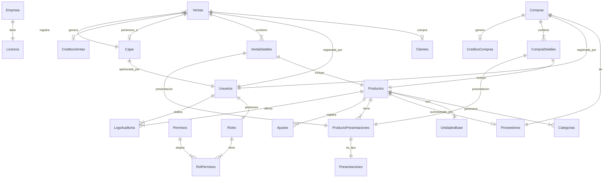

# 🗄️ DISEÑO COMPLETO DE BASE DE DATOS - SISTEMA POS AGROPECUARIO

**Versión:** 1.0  
**Motor:** SQLite  
**Fecha:** 27 de Enero 2026  
**Codificación:** UTF-8

---

## 📊 ÍNDICE

1. [Resumen Ejecutivo](#1-resumen-ejecutivo)
2. [Diagrama de Relaciones](#2-diagrama-de-relaciones)
3. [Tablas del Sistema](#3-tablas-del-sistema)
4. [Scripts SQL de Creación](#4-scripts-sql-de-creación)
5. [Datos de Inicialización](#5-datos-de-inicialización)
6. [Índices y Optimizaciones](#6-índices-y-optimizaciones)
7. [Consideraciones Técnicas](#7-consideraciones-técnicas)

---

## 1. RESUMEN EJECUTIVO

### **Estadísticas de la Base de Datos:**

```
Total de Tablas:        25
Tablas principales:     15
Tablas de configuración: 10
Relaciones (FK):        35+
Índices:                40+
```

### **Módulos del sistema:**

- 🏢 **Configuración:** Empresa, Usuarios, Roles, Permisos, Licencia
- 📦 **Inventario:** Productos, Categorías, Unidades, Presentaciones, Ajustes
- 🛒 **Ventas:** Ventas, VentaDetalles, Métodos de pago
- 📥 **Compras:** Compras, CompraDetalles, Proveedores
- 💰 **Finanzas:** Cajas, Créditos (ventas y compras)
- 👥 **Contactos:** Clientes, Proveedores
- 📊 **Auditoría:** Logs de todas las operaciones críticas

---

## 2. DIAGRAMA DE RELACIONES

### **Diagrama Visual (Mermaid)**



---

## 3. TABLAS DEL SISTEMA

### 📋 **3.1. CONFIGURACIÓN**

#### **Tabla: Empresa**
Datos de la empresa para facturación y configuración.

| Campo | Tipo | Restricciones | Descripción |
|-------|------|---------------|-------------|
| EmpresaID | INTEGER | PRIMARY KEY AUTOINCREMENT | ID único |
| RUC | TEXT(11) | NOT NULL UNIQUE | RUC de 11 dígitos |
| RazonSocial | TEXT(200) | NOT NULL | Razón social completa |
| NombreComercial | TEXT(200) | NULL | Nombre comercial |
| Direccion | TEXT(300) | NULL | Dirección fiscal |
| Departamento | TEXT(50) | NULL | Departamento |
| Provincia | TEXT(50) | NULL | Provincia |
| Distrito | TEXT(50) | NULL | Distrito |
| Ubigeo | TEXT(6) | NULL | Código ubigeo |
| Telefono | TEXT(20) | NULL | Teléfono contacto |
| Email | TEXT(100) | NULL | Email de contacto |
| Web | TEXT(100) | NULL | Sitio web |
| Logo | BLOB | NULL | Logo en bytes |
| FechaRegistro | TEXT | DEFAULT CURRENT_TIMESTAMP | Fecha de registro |
| Activo | INTEGER | DEFAULT 1 | 1=Activo, 0=Inactivo |

#### **Tabla: Licencia**
Control de licencia del sistema.

| Campo | Tipo | Restricciones | Descripción |
|-------|------|---------------|-------------|
| LicenciaID | INTEGER | PRIMARY KEY AUTOINCREMENT | ID único |
| CodigoLicencia | TEXT(50) | NOT NULL UNIQUE | Código de licencia |
| TipoLicencia | TEXT(20) | NOT NULL | MENSUAL/ANUAL/PERPETUA |
| FechaActivacion | TEXT | NULL | Fecha de activación |
| FechaVencimiento | TEXT | NULL | Fecha de vencimiento |
| Estado | TEXT(20) | DEFAULT 'INACTIVA' | ACTIVA/INACTIVA/VENCIDA |
| EmpresaID | INTEGER | NOT NULL | FK a Empresa |
| **FOREIGN KEY** | (EmpresaID) | REFERENCES Empresa(EmpresaID) | |

#### **Tabla: Roles**
Roles del sistema (Admin, Vendedor, Cajero).

| Campo | Tipo | Restricciones | Descripción |
|-------|------|---------------|-------------|
| RolID | INTEGER | PRIMARY KEY AUTOINCREMENT | ID único |
| Nombre | TEXT(50) | NOT NULL UNIQUE | Nombre del rol |
| Descripcion | TEXT(200) | NULL | Descripción |
| Activo | INTEGER | DEFAULT 1 | 1=Activo, 0=Inactivo |

#### **Tabla: Permisos**
Permisos granulares por módulo.

| Campo | Tipo | Restricciones | Descripción |
|-------|------|---------------|-------------|
| PermisoID | INTEGER | PRIMARY KEY AUTOINCREMENT | ID único |
| Modulo | TEXT(50) | NOT NULL | Ventas/Compras/Inventario/etc |
| Accion | TEXT(50) | NOT NULL | Ver/Crear/Editar/Eliminar |
| Descripcion | TEXT(200) | NULL | Descripción del permiso |
| CodigoPermiso | TEXT(100) | NOT NULL UNIQUE | VENTAS_VER, VENTAS_CREAR, etc |

#### **Tabla: RolPermisos**
Relación Roles-Permisos (N:M).

| Campo | Tipo | Restricciones | Descripción |
|-------|------|---------------|-------------|
| RolPermisoID | INTEGER | PRIMARY KEY AUTOINCREMENT | ID único |
| RolID | INTEGER | NOT NULL | FK a Roles |
| PermisoID | INTEGER | NOT NULL | FK a Permisos |
| **FOREIGN KEY** | (RolID) | REFERENCES Roles(RolID) | |
| **FOREIGN KEY** | (PermisoID) | REFERENCES Permisos(PermisoID) | |
| **UNIQUE** | (RolID, PermisoID) | | No duplicar combinación |

#### **Tabla: Usuarios**
Usuarios del sistema con sus credenciales.

| Campo | Tipo | Restricciones | Descripción |
|-------|------|---------------|-------------|
| UsuarioID | INTEGER | PRIMARY KEY AUTOINCREMENT | ID único |
| NombreUsuario | TEXT(50) | NOT NULL UNIQUE | Usuario para login |
| Contraseña | TEXT(100) | NOT NULL | Hash de contraseña |
| NombreCompleto | TEXT(100) | NOT NULL | Nombre y apellidos |
| DNI | TEXT(8) | NOT NULL UNIQUE | DNI de 8 dígitos |
| Email | TEXT(100) | NULL | Email opcional |
| Telefono | TEXT(20) | NULL | Teléfono opcional |
| RolID | INTEGER | NOT NULL | FK a Roles |
| FechaCreacion | TEXT | DEFAULT CURRENT_TIMESTAMP | Fecha de creación |
| UltimoAcceso | TEXT | NULL | Último login |
| Activo | INTEGER | DEFAULT 1 | 1=Activo, 0=Inactivo |
| **FOREIGN KEY** | (RolID) | REFERENCES Roles(RolID) | |

#### **Tabla: ConfigGeneral**
Configuraciones generales del sistema.

| Campo | Tipo | Restricciones | Descripción |
|-------|------|---------------|-------------|
| ConfigID | INTEGER | PRIMARY KEY AUTOINCREMENT | ID único |
| Clave | TEXT(100) | NOT NULL UNIQUE | Nombre de la configuración |
| Valor | TEXT(500) | NULL | Valor de la configuración |
| Descripcion | TEXT(200) | NULL | Descripción |
| Tipo | TEXT(20) | NOT NULL | STRING/INTEGER/BOOLEAN/DECIMAL |
| Categoria | TEXT(50) | NULL | General/Facturacion/Impresion/etc |

---

### 📦 **3.2. INVENTARIO**

#### **Tabla: Categorias**
Categorías de productos (Alimentos, Vitaminas, etc).

| Campo | Tipo | Restricciones | Descripción |
|-------|------|---------------|-------------|
| CategoriaID | INTEGER | PRIMARY KEY AUTOINCREMENT | ID único |
| Nombre | TEXT(100) | NOT NULL UNIQUE | Nombre de categoría |
| Descripcion | TEXT(300) | NULL | Descripción opcional |
| Activo | INTEGER | DEFAULT 1 | 1=Activo, 0=Inactivo |

#### **Tabla: UnidadesBase**
Unidades de medida base (kg, L, ml, unidades).

| Campo | Tipo | Restricciones | Descripción |
|-------|------|---------------|-------------|
| UnidadID | INTEGER | PRIMARY KEY AUTOINCREMENT | ID único |
| Nombre | TEXT(50) | NOT NULL UNIQUE | kg, L, ml, unidades |
| Simbolo | TEXT(10) | NOT NULL | kg, L, ml, un |
| Tipo | TEXT(20) | NOT NULL | PESO/VOLUMEN/UNIDAD |
| Activo | INTEGER | DEFAULT 1 | 1=Activo, 0=Inactivo |

#### **Tabla: Presentaciones**
Tipos de presentación (Saco, Bolsa, Frasco, etc).

| Campo | Tipo | Restricciones | Descripción |
|-------|------|---------------|-------------|
| PresentacionID | INTEGER | PRIMARY KEY AUTOINCREMENT | ID único |
| Nombre | TEXT(50) | NOT NULL UNIQUE | Saco, Bolsa, Frasco, Granel, etc |
| Descripcion | TEXT(200) | NULL | Descripción opcional |
| Activo | INTEGER | DEFAULT 1 | 1=Activo, 0=Inactivo |

#### **Tabla: Productos**
Productos principales con stock único.

| Campo | Tipo | Restricciones | Descripción |
|-------|------|---------------|-------------|
| ProductoID | INTEGER | PRIMARY KEY AUTOINCREMENT | ID único |
| Codigo | TEXT(50) | NOT NULL UNIQUE | Código único del producto |
| CodigoBarras | TEXT(50) | NULL | Código de barras EAN |
| Nombre | TEXT(200) | NOT NULL | Nombre del producto |
| Descripcion | TEXT(500) | NULL | Descripción detallada |
| CategoriaID | INTEGER | NOT NULL | FK a Categorias |
| UnidadBaseID | INTEGER | NOT NULL | FK a UnidadesBase |
| StockTotal | REAL | DEFAULT 0 | Stock actual en unidad base |
| StockMinimo | REAL | DEFAULT 0 | Stock mínimo (alerta) |
| StockMaximo | REAL | DEFAULT 0 | Stock máximo (alerta) |
| ProveedorID | INTEGER | NULL | FK a Proveedores (predeterminado) |
| Imagen | BLOB | NULL | Imagen del producto |
| FechaCreacion | TEXT | DEFAULT CURRENT_TIMESTAMP | Fecha de creación |
| FechaUltimaModificacion | TEXT | NULL | Última modificación |
| Activo | INTEGER | DEFAULT 1 | 1=Activo, 0=Inactivo |
| **FOREIGN KEY** | (CategoriaID) | REFERENCES Categorias(CategoriaID) | |
| **FOREIGN KEY** | (UnidadBaseID) | REFERENCES UnidadesBase(UnidadID) | |
| **FOREIGN KEY** | (ProveedorID) | REFERENCES Proveedores(ProveedorID) | |

#### **Tabla: ProductoPresentaciones**
Presentaciones disponibles por producto con sus precios.

| Campo | Tipo | Restricciones | Descripción |
|-------|------|---------------|-------------|
| ProductoPresentacionID | INTEGER | PRIMARY KEY AUTOINCREMENT | ID único |
| ProductoID | INTEGER | NOT NULL | FK a Productos |
| PresentacionID | INTEGER | NOT NULL | FK a Presentaciones |
| CantidadUnidades | REAL | NOT NULL | Cantidad en unidad base (ej: 50 kg) |
| CostoBase | REAL | NOT NULL | Costo de esta presentación |
| PrecioVenta | REAL | NOT NULL | Precio de venta |
| Ganancia | REAL | NULL | % de ganancia calculado |
| Activo | INTEGER | DEFAULT 1 | 1=Activo, 0=Inactivo |
| **FOREIGN KEY** | (ProductoID) | REFERENCES Productos(ProductoID) | |
| **FOREIGN KEY** | (PresentacionID) | REFERENCES Presentaciones(PresentacionID) | |
| **UNIQUE** | (ProductoID, PresentacionID) | | No duplicar combinación |

#### **Tabla: Ajustes**
Ajustes de inventario (entrada, salida, corrección).

| Campo | Tipo | Restricciones | Descripción |
|-------|------|---------------|-------------|
| AjusteID | INTEGER | PRIMARY KEY AUTOINCREMENT | ID único |
| ProductoID | INTEGER | NOT NULL | FK a Productos |
| TipoAjuste | TEXT(20) | NOT NULL | ENTRADA/SALIDA/CORRECCION |
| Cantidad | REAL | NOT NULL | Cantidad ajustada (+ o -) |
| StockAnterior | REAL | NOT NULL | Stock antes del ajuste |
| StockNuevo | REAL | NOT NULL | Stock después del ajuste |
| Motivo | TEXT(300) | NULL | Motivo del ajuste |
| UsuarioID | INTEGER | NOT NULL | FK a Usuarios |
| Fecha | TEXT | DEFAULT CURRENT_TIMESTAMP | Fecha y hora del ajuste |
| **FOREIGN KEY** | (ProductoID) | REFERENCES Productos(ProductoID) | |
| **FOREIGN KEY** | (UsuarioID) | REFERENCES Usuarios(UsuarioID) | |

---

### 🛒 **3.3. VENTAS**

#### **Tabla: Ventas**
Cabecera de las ventas.

| Campo | Tipo | Restricciones | Descripción |
|-------|------|---------------|-------------|
| VentaID | INTEGER | PRIMARY KEY AUTOINCREMENT | ID único |
| NumeroVenta | TEXT(20) | NOT NULL UNIQUE | Número único de venta |
| Fecha | TEXT | NOT NULL | Fecha de la venta |
| Hora | TEXT | NOT NULL | Hora de la venta |
| ClienteID | INTEGER | NULL | FK a Clientes (NULL=genérico) |
| TipoComprobante | TEXT(20) | NOT NULL | BOLETA/FACTURA/NOTA_VENTA |
| Serie | TEXT(10) | NULL | Serie del comprobante |
| Numero | TEXT(20) | NULL | Número del comprobante |
| SubTotal | REAL | NOT NULL | Subtotal sin IGV |
| IGV | REAL | NOT NULL | Monto del IGV (18%) |
| Total | REAL | NOT NULL | Total a pagar |
| MetodoPago | TEXT(20) | NOT NULL | EFECTIVO/YAPE/TARJETA/TRANSFERENCIA/MIXTO/CREDITO |
| MontoEfectivo | REAL | DEFAULT 0 | Monto en efectivo (pago mixto) |
| MontoYape | REAL | DEFAULT 0 | Monto en Yape (pago mixto) |
| MontoTarjeta | REAL | DEFAULT 0 | Monto en tarjeta (pago mixto) |
| MontoTransferencia | REAL | DEFAULT 0 | Monto en transferencia (pago mixto) |
| Estado | TEXT(20) | DEFAULT 'COMPLETADA' | COMPLETADA/ANULADA/CREDITO |
| CajaID | INTEGER | NULL | FK a Cajas |
| UsuarioID | INTEGER | NOT NULL | FK a Usuarios |
| Observaciones | TEXT(500) | NULL | Observaciones |
| FechaAnulacion | TEXT | NULL | Fecha de anulación |
| MotivoAnulacion | TEXT(300) | NULL | Motivo de anulación |
| **FOREIGN KEY** | (ClienteID) | REFERENCES Clientes(ClienteID) | |
| **FOREIGN KEY** | (CajaID) | REFERENCES Cajas(CajaID) | |
| **FOREIGN KEY** | (UsuarioID) | REFERENCES Usuarios(UsuarioID) | |

#### **Tabla: VentaDetalles**
Detalle de productos vendidos.

| Campo | Tipo | Restricciones | Descripción |
|-------|------|---------------|-------------|
| VentaDetalleID | INTEGER | PRIMARY KEY AUTOINCREMENT | ID único |
| VentaID | INTEGER | NOT NULL | FK a Ventas |
| ProductoID | INTEGER | NOT NULL | FK a Productos |
| ProductoPresentacionID | INTEGER | NOT NULL | FK a ProductoPresentaciones |
| Cantidad | REAL | NOT NULL | Cantidad vendida |
| PrecioUnitario | REAL | NOT NULL | Precio unitario |
| Subtotal | REAL | NOT NULL | Cantidad × PrecioUnitario |
| CantidadUnidadesBase | REAL | NOT NULL | Cantidad descontada del stock |
| **FOREIGN KEY** | (VentaID) | REFERENCES Ventas(VentaID) ON DELETE CASCADE | |
| **FOREIGN KEY** | (ProductoID) | REFERENCES Productos(ProductoID) | |
| **FOREIGN KEY** | (ProductoPresentacionID) | REFERENCES ProductoPresentaciones(ProductoPresentacionID) | |

#### **Tabla: CreditosVentas**
Control de ventas a crédito.

| Campo | Tipo | Restricciones | Descripción |
|-------|------|---------------|-------------|
| CreditoVentaID | INTEGER | PRIMARY KEY AUTOINCREMENT | ID único |
| VentaID | INTEGER | NOT NULL UNIQUE | FK a Ventas |
| ClienteID | INTEGER | NOT NULL | FK a Clientes |
| MontoTotal | REAL | NOT NULL | Monto total del crédito |
| MontoPagado | REAL | DEFAULT 0 | Monto pagado hasta ahora |
| Saldo | REAL | NOT NULL | Saldo pendiente |
| FechaVencimiento | TEXT | NOT NULL | Fecha de vencimiento |
| Estado | TEXT(20) | DEFAULT 'PENDIENTE' | PENDIENTE/PAGADO/VENCIDO |
| FechaRegistro | TEXT | DEFAULT CURRENT_TIMESTAMP | Fecha de registro |
| FechaPago | TEXT | NULL | Fecha de pago completo |
| **FOREIGN KEY** | (VentaID) | REFERENCES Ventas(VentaID) | |
| **FOREIGN KEY** | (ClienteID) | REFERENCES Clientes(ClienteID) | |

---

### 📥 **3.4. COMPRAS**

#### **Tabla: Compras**
Cabecera de las compras a proveedores.

| Campo | Tipo | Restricciones | Descripción |
|-------|------|---------------|-------------|
| CompraID | INTEGER | PRIMARY KEY AUTOINCREMENT | ID único |
| NumeroCompra | TEXT(20) | NOT NULL UNIQUE | Número único de compra |
| Fecha | TEXT | NOT NULL | Fecha de la compra |
| Hora | TEXT | NOT NULL | Hora de la compra |
| ProveedorID | INTEGER | NOT NULL | FK a Proveedores |
| TipoComprobante | TEXT(20) | NOT NULL | FACTURA/BOLETA/GUIA |
| Serie | TEXT(10) | NULL | Serie del comprobante |
| Numero | TEXT(20) | NULL | Número del comprobante |
| IncluyeIGV | INTEGER | NOT NULL | 1=Incluye IGV, 0=No incluye |
| SubTotal | REAL | NOT NULL | Subtotal |
| IGV | REAL | NOT NULL | Monto del IGV |
| Total | REAL | NOT NULL | Total pagado |
| MetodoPago | TEXT(20) | NOT NULL | EFECTIVO/TRANSFERENCIA/CREDITO |
| Estado | TEXT(20) | DEFAULT 'COMPLETADA' | COMPLETADA/ANULADA/CREDITO |
| UsuarioID | INTEGER | NOT NULL | FK a Usuarios |
| Observaciones | TEXT(500) | NULL | Observaciones |
| FechaAnulacion | TEXT | NULL | Fecha de anulación |
| MotivoAnulacion | TEXT(300) | NULL | Motivo de anulación |
| **FOREIGN KEY** | (ProveedorID) | REFERENCES Proveedores(ProveedorID) | |
| **FOREIGN KEY** | (UsuarioID) | REFERENCES Usuarios(UsuarioID) | |

#### **Tabla: CompraDetalles**
Detalle de productos comprados.

| Campo | Tipo | Restricciones | Descripción |
|-------|------|---------------|-------------|
| CompraDetalleID | INTEGER | PRIMARY KEY AUTOINCREMENT | ID único |
| CompraID | INTEGER | NOT NULL | FK a Compras |
| ProductoID | INTEGER | NOT NULL | FK a Productos |
| ProductoPresentacionID | INTEGER | NOT NULL | FK a ProductoPresentaciones |
| Cantidad | REAL | NOT NULL | Cantidad comprada |
| CostoUnitario | REAL | NOT NULL | Costo unitario |
| Subtotal | REAL | NOT NULL | Cantidad × CostoUnitario |
| CantidadUnidadesBase | REAL | NOT NULL | Cantidad añadida al stock |
| **FOREIGN KEY** | (CompraID) | REFERENCES Compras(CompraID) ON DELETE CASCADE | |
| **FOREIGN KEY** | (ProductoID) | REFERENCES Productos(ProductoID) | |
| **FOREIGN KEY** | (ProductoPresentacionID) | REFERENCES ProductoPresentaciones(ProductoPresentacionID) | |

#### **Tabla: CreditosCompras**
Control de compras a crédito.

| Campo | Tipo | Restricciones | Descripción |
|-------|------|---------------|-------------|
| CreditoCompraID | INTEGER | PRIMARY KEY AUTOINCREMENT | ID único |
| CompraID | INTEGER | NOT NULL UNIQUE | FK a Compras |
| ProveedorID | INTEGER | NOT NULL | FK a Proveedores |
| MontoTotal | REAL | NOT NULL | Monto total del crédito |
| MontoPagado | REAL | DEFAULT 0 | Monto pagado hasta ahora |
| Saldo | REAL | NOT NULL | Saldo pendiente |
| FechaVencimiento | TEXT | NOT NULL | Fecha de vencimiento |
| Estado | TEXT(20) | DEFAULT 'PENDIENTE' | PENDIENTE/PAGADO/VENCIDO |
| FechaRegistro | TEXT | DEFAULT CURRENT_TIMESTAMP | Fecha de registro |
| FechaPago | TEXT | NULL | Fecha de pago completo |
| **FOREIGN KEY** | (CompraID) | REFERENCES Compras(CompraID) | |
| **FOREIGN KEY** | (ProveedorID) | REFERENCES Proveedores(ProveedorID) | |

---

### 👥 **3.5. CONTACTOS**

#### **Tabla: Clientes**
Base de datos de clientes.

| Campo | Tipo | Restricciones | Descripción |
|-------|------|---------------|-------------|
| ClienteID | INTEGER | PRIMARY KEY AUTOINCREMENT | ID único |
| TipoDocumento | TEXT(20) | NOT NULL | DNI/RUC/CE/PASAPORTE |
| NumeroDocumento | TEXT(20) | NOT NULL UNIQUE | Número del documento |
| Nombres | TEXT(100) | NULL | Nombres (personas) |
| Apellidos | TEXT(100) | NULL | Apellidos (personas) |
| RazonSocial | TEXT(200) | NULL | Razón social (empresas) |
| Direccion | TEXT(300) | NULL | Dirección |
| Telefono | TEXT(20) | NULL | Teléfono |
| Email | TEXT(100) | NULL | Email |
| LimiteCredito | REAL | DEFAULT 0 | Límite de crédito |
| FechaRegistro | TEXT | DEFAULT CURRENT_TIMESTAMP | Fecha de registro |
| Activo | INTEGER | DEFAULT 1 | 1=Activo, 0=Inactivo |

#### **Tabla: Proveedores**
Base de datos de proveedores.

| Campo | Tipo | Restricciones | Descripción |
|-------|------|---------------|-------------|
| ProveedorID | INTEGER | PRIMARY KEY AUTOINCREMENT | ID único |
| RUC | TEXT(11) | NOT NULL UNIQUE | RUC de 11 dígitos |
| RazonSocial | TEXT(200) | NOT NULL | Razón social |
| NombreComercial | TEXT(200) | NULL | Nombre comercial |
| Direccion | TEXT(300) | NULL | Dirección |
| Telefono | TEXT(20) | NULL | Teléfono |
| Email | TEXT(100) | NULL | Email |
| Contacto | TEXT(100) | NULL | Nombre del contacto |
| TelefonoContacto | TEXT(20) | NULL | Teléfono del contacto |
| FechaRegistro | TEXT | DEFAULT CURRENT_TIMESTAMP | Fecha de registro |
| Activo | INTEGER | DEFAULT 1 | 1=Activo, 0=Inactivo |

---

### 💰 **3.6. FINANZAS**

#### **Tabla: Cajas**
Control de apertura y cierre de caja.

| Campo | Tipo | Restricciones | Descripción |
|-------|------|---------------|-------------|
| CajaID | INTEGER | PRIMARY KEY AUTOINCREMENT | ID único |
| UsuarioID | INTEGER | NOT NULL | FK a Usuarios |
| Turno | TEXT(20) | NOT NULL | MAÑANA/TARDE/NOCHE |
| FechaApertura | TEXT | NOT NULL | Fecha de apertura |
| HoraApertura | TEXT | NOT NULL | Hora de apertura |
| FechaCierre | TEXT | NULL | Fecha de cierre |
| HoraCierre | TEXT | NULL | Hora de cierre |
| MontoInicial | REAL | NOT NULL | Monto inicial en caja |
| TotalVentas | REAL | DEFAULT 0 | Total de ventas |
| TotalEfectivo | REAL | DEFAULT 0 | Total en efectivo |
| TotalYape | REAL | DEFAULT 0 | Total en Yape |
| TotalTarjeta | REAL | DEFAULT 0 | Total en tarjeta |
| TotalTransferencia | REAL | DEFAULT 0 | Total en transferencia |
| EfectivoEsperado | REAL | DEFAULT 0 | Efectivo esperado (inicial + ventas efectivo) |
| EfectivoReal | REAL | DEFAULT 0 | Efectivo real contado |
| Diferencia | REAL | DEFAULT 0 | Diferencia (Real - Esperado) |
| MotivoDiferencia | TEXT(300) | NULL | Motivo si hay diferencia |
| Estado | TEXT(20) | DEFAULT 'ABIERTA' | ABIERTA/CERRADA |
| **FOREIGN KEY** | (UsuarioID) | REFERENCES Usuarios(UsuarioID) | |

---

### 📊 **3.7. AUDITORÍA**

#### **Tabla: LogsAuditoria**
Registro de todas las operaciones críticas.

| Campo | Tipo | Restricciones | Descripción |
|-------|------|---------------|-------------|
| LogID | INTEGER | PRIMARY KEY AUTOINCREMENT | ID único |
| Fecha | TEXT | DEFAULT CURRENT_TIMESTAMP | Fecha y hora |
| UsuarioID | INTEGER | NOT NULL | FK a Usuarios |
| Modulo | TEXT(50) | NOT NULL | Ventas/Compras/Inventario/etc |
| Accion | TEXT(50) | NOT NULL | CREAR/EDITAR/ELIMINAR/ANULAR/etc |
| TablaAfectada | TEXT(50) | NOT NULL | Nombre de la tabla |
| RegistroID | INTEGER | NULL | ID del registro afectado |
| ValorAnterior | TEXT | NULL | Valor antes del cambio (JSON) |
| ValorNuevo | TEXT | NULL | Valor después del cambio (JSON) |
| DireccionIP | TEXT(50) | NULL | IP del usuario |
| Detalles | TEXT(500) | NULL | Detalles adicionales |
| **FOREIGN KEY** | (UsuarioID) | REFERENCES Usuarios(UsuarioID) | |

---

## 4. SCRIPTS SQL DE CREACIÓN

### **Script Completo de Creación**

```sql
-- ============================================================
-- SCRIPT DE CREACIÓN DE BASE DE DATOS
-- Sistema POS Agropecuario
-- Motor: SQLite
-- Versión: 1.0
-- Fecha: 27 de Enero 2026
-- ============================================================

-- Habilitar claves foráneas (SQLite)
PRAGMA foreign_keys = ON;

-- ============================================================
-- MÓDULO: CONFIGURACIÓN
-- ============================================================

-- Tabla: Empresa
CREATE TABLE IF NOT EXISTS Empresa (
    EmpresaID INTEGER PRIMARY KEY AUTOINCREMENT,
    RUC TEXT(11) NOT NULL UNIQUE,
    RazonSocial TEXT(200) NOT NULL,
    NombreComercial TEXT(200),
    Direccion TEXT(300),
    Departamento TEXT(50),
    Provincia TEXT(50),
    Distrito TEXT(50),
    Ubigeo TEXT(6),
    Telefono TEXT(20),
    Email TEXT(100),
    Web TEXT(100),
    Logo BLOB,
    FechaRegistro TEXT DEFAULT CURRENT_TIMESTAMP,
    Activo INTEGER DEFAULT 1 CHECK(Activo IN (0,1))
);

-- Tabla: Licencia
CREATE TABLE IF NOT EXISTS Licencia (
    LicenciaID INTEGER PRIMARY KEY AUTOINCREMENT,
    CodigoLicencia TEXT(50) NOT NULL UNIQUE,
    TipoLicencia TEXT(20) NOT NULL CHECK(TipoLicencia IN ('MENSUAL','ANUAL','PERPETUA')),
    FechaActivacion TEXT,
    FechaVencimiento TEXT,
    Estado TEXT(20) DEFAULT 'INACTIVA' CHECK(Estado IN ('ACTIVA','INACTIVA','VENCIDA')),
    EmpresaID INTEGER NOT NULL,
    FOREIGN KEY (EmpresaID) REFERENCES Empresa(EmpresaID) ON DELETE CASCADE
);

-- Tabla: Roles
CREATE TABLE IF NOT EXISTS Roles (
    RolID INTEGER PRIMARY KEY AUTOINCREMENT,
    Nombre TEXT(50) NOT NULL UNIQUE,
    Descripcion TEXT(200),
    Activo INTEGER DEFAULT 1 CHECK(Activo IN (0,1))
);

-- Tabla: Permisos
CREATE TABLE IF NOT EXISTS Permisos (
    PermisoID INTEGER PRIMARY KEY AUTOINCREMENT,
    Modulo TEXT(50) NOT NULL,
    Accion TEXT(50) NOT NULL,
    Descripcion TEXT(200),
    CodigoPermiso TEXT(100) NOT NULL UNIQUE
);

-- Tabla: RolPermisos
CREATE TABLE IF NOT EXISTS RolPermisos (
    RolPermisoID INTEGER PRIMARY KEY AUTOINCREMENT,
    RolID INTEGER NOT NULL,
    PermisoID INTEGER NOT NULL,
    FOREIGN KEY (RolID) REFERENCES Roles(RolID) ON DELETE CASCADE,
    FOREIGN KEY (PermisoID) REFERENCES Permisos(PermisoID) ON DELETE CASCADE,
    UNIQUE(RolID, PermisoID)
);

-- Tabla: Usuarios
CREATE TABLE IF NOT EXISTS Usuarios (
    UsuarioID INTEGER PRIMARY KEY AUTOINCREMENT,
    NombreUsuario TEXT(50) NOT NULL UNIQUE,
    Contraseña TEXT(100) NOT NULL,
    NombreCompleto TEXT(100) NOT NULL,
    DNI TEXT(8) NOT NULL UNIQUE,
    Email TEXT(100),
    Telefono TEXT(20),
    RolID INTEGER NOT NULL,
    FechaCreacion TEXT DEFAULT CURRENT_TIMESTAMP,
    UltimoAcceso TEXT,
    Activo INTEGER DEFAULT 1 CHECK(Activo IN (0,1)),
    FOREIGN KEY (RolID) REFERENCES Roles(RolID)
);

-- Tabla: ConfigGeneral
CREATE TABLE IF NOT EXISTS ConfigGeneral (
    ConfigID INTEGER PRIMARY KEY AUTOINCREMENT,
    Clave TEXT(100) NOT NULL UNIQUE,
    Valor TEXT(500),
    Descripcion TEXT(200),
    Tipo TEXT(20) NOT NULL CHECK(Tipo IN ('STRING','INTEGER','BOOLEAN','DECIMAL')),
    Categoria TEXT(50)
);

-- ============================================================
-- MÓDULO: INVENTARIO
-- ============================================================

-- Tabla: Categorias
CREATE TABLE IF NOT EXISTS Categorias (
    CategoriaID INTEGER PRIMARY KEY AUTOINCREMENT,
    Nombre TEXT(100) NOT NULL UNIQUE,
    Descripcion TEXT(300),
    Activo INTEGER DEFAULT 1 CHECK(Activo IN (0,1))
);

-- Tabla: UnidadesBase
CREATE TABLE IF NOT EXISTS UnidadesBase (
    UnidadID INTEGER PRIMARY KEY AUTOINCREMENT,
    Nombre TEXT(50) NOT NULL UNIQUE,
    Simbolo TEXT(10) NOT NULL,
    Tipo TEXT(20) NOT NULL CHECK(Tipo IN ('PESO','VOLUMEN','UNIDAD')),
    Activo INTEGER DEFAULT 1 CHECK(Activo IN (0,1))
);

-- Tabla: Presentaciones
CREATE TABLE IF NOT EXISTS Presentaciones (
    PresentacionID INTEGER PRIMARY KEY AUTOINCREMENT,
    Nombre TEXT(50) NOT NULL UNIQUE,
    Descripcion TEXT(200),
    Activo INTEGER DEFAULT 1 CHECK(Activo IN (0,1))
);

-- Tabla: Proveedores (debe estar antes de Productos)
CREATE TABLE IF NOT EXISTS Proveedores (
    ProveedorID INTEGER PRIMARY KEY AUTOINCREMENT,
    RUC TEXT(11) NOT NULL UNIQUE,
    RazonSocial TEXT(200) NOT NULL,
    NombreComercial TEXT(200),
    Direccion TEXT(300),
    Telefono TEXT(20),
    Email TEXT(100),
    Contacto TEXT(100),
    TelefonoContacto TEXT(20),
    FechaRegistro TEXT DEFAULT CURRENT_TIMESTAMP,
    Activo INTEGER DEFAULT 1 CHECK(Activo IN (0,1))
);

-- Tabla: Productos
CREATE TABLE IF NOT EXISTS Productos (
    ProductoID INTEGER PRIMARY KEY AUTOINCREMENT,
    Codigo TEXT(50) NOT NULL UNIQUE,
    CodigoBarras TEXT(50),
    Nombre TEXT(200) NOT NULL,
    Descripcion TEXT(500),
    CategoriaID INTEGER NOT NULL,
    UnidadBaseID INTEGER NOT NULL,
    StockTotal REAL DEFAULT 0 CHECK(StockTotal >= 0),
    StockMinimo REAL DEFAULT 0 CHECK(StockMinimo >= 0),
    StockMaximo REAL DEFAULT 0 CHECK(StockMaximo >= 0),
    ProveedorID INTEGER,
    Imagen BLOB,
    FechaCreacion TEXT DEFAULT CURRENT_TIMESTAMP,
    FechaUltimaModificacion TEXT,
    Activo INTEGER DEFAULT 1 CHECK(Activo IN (0,1)),
    FOREIGN KEY (CategoriaID) REFERENCES Categorias(CategoriaID),
    FOREIGN KEY (UnidadBaseID) REFERENCES UnidadesBase(UnidadID),
    FOREIGN KEY (ProveedorID) REFERENCES Proveedores(ProveedorID) ON DELETE SET NULL
);

-- Tabla: ProductoPresentaciones
CREATE TABLE IF NOT EXISTS ProductoPresentaciones (
    ProductoPresentacionID INTEGER PRIMARY KEY AUTOINCREMENT,
    ProductoID INTEGER NOT NULL,
    PresentacionID INTEGER NOT NULL,
    CantidadUnidades REAL NOT NULL CHECK(CantidadUnidades > 0),
    CostoBase REAL NOT NULL CHECK(CostoBase >= 0),
    PrecioVenta REAL NOT NULL CHECK(PrecioVenta >= 0),
    Ganancia REAL,
    Activo INTEGER DEFAULT 1 CHECK(Activo IN (0,1)),
    FOREIGN KEY (ProductoID) REFERENCES Productos(ProductoID) ON DELETE CASCADE,
    FOREIGN KEY (PresentacionID) REFERENCES Presentaciones(PresentacionID),
    UNIQUE(ProductoID, PresentacionID)
);

-- Tabla: Ajustes
CREATE TABLE IF NOT EXISTS Ajustes (
    AjusteID INTEGER PRIMARY KEY AUTOINCREMENT,
    ProductoID INTEGER NOT NULL,
    TipoAjuste TEXT(20) NOT NULL CHECK(TipoAjuste IN ('ENTRADA','SALIDA','CORRECCION')),
    Cantidad REAL NOT NULL,
    StockAnterior REAL NOT NULL,
    StockNuevo REAL NOT NULL CHECK(StockNuevo >= 0),
    Motivo TEXT(300),
    UsuarioID INTEGER NOT NULL,
    Fecha TEXT DEFAULT CURRENT_TIMESTAMP,
    FOREIGN KEY (ProductoID) REFERENCES Productos(ProductoID),
    FOREIGN KEY (UsuarioID) REFERENCES Usuarios(UsuarioID)
);

-- ============================================================
-- MÓDULO: CONTACTOS
-- ============================================================

-- Tabla: Clientes
CREATE TABLE IF NOT EXISTS Clientes (
    ClienteID INTEGER PRIMARY KEY AUTOINCREMENT,
    TipoDocumento TEXT(20) NOT NULL CHECK(TipoDocumento IN ('DNI','RUC','CE','PASAPORTE')),
    NumeroDocumento TEXT(20) NOT NULL UNIQUE,
    Nombres TEXT(100),
    Apellidos TEXT(100),
    RazonSocial TEXT(200),
    Direccion TEXT(300),
    Telefono TEXT(20),
    Email TEXT(100),
    LimiteCredito REAL DEFAULT 0 CHECK(LimiteCredito >= 0),
    FechaRegistro TEXT DEFAULT CURRENT_TIMESTAMP,
    Activo INTEGER DEFAULT 1 CHECK(Activo IN (0,1))
);

-- ============================================================
-- MÓDULO: FINANZAS
-- ============================================================

-- Tabla: Cajas
CREATE TABLE IF NOT EXISTS Cajas (
    CajaID INTEGER PRIMARY KEY AUTOINCREMENT,
    UsuarioID INTEGER NOT NULL,
    Turno TEXT(20) NOT NULL CHECK(Turno IN ('MAÑANA','TARDE','NOCHE')),
    FechaApertura TEXT NOT NULL,
    HoraApertura TEXT NOT NULL,
    FechaCierre TEXT,
    HoraCierre TEXT,
    MontoInicial REAL NOT NULL CHECK(MontoInicial >= 0),
    TotalVentas REAL DEFAULT 0 CHECK(TotalVentas >= 0),
    TotalEfectivo REAL DEFAULT 0 CHECK(TotalEfectivo >= 0),
    TotalYape REAL DEFAULT 0 CHECK(TotalYape >= 0),
    TotalTarjeta REAL DEFAULT 0 CHECK(TotalTarjeta >= 0),
    TotalTransferencia REAL DEFAULT 0 CHECK(TotalTransferencia >= 0),
    EfectivoEsperado REAL DEFAULT 0,
    EfectivoReal REAL DEFAULT 0,
    Diferencia REAL DEFAULT 0,
    MotivoDiferencia TEXT(300),
    Estado TEXT(20) DEFAULT 'ABIERTA' CHECK(Estado IN ('ABIERTA','CERRADA')),
    FOREIGN KEY (UsuarioID) REFERENCES Usuarios(UsuarioID)
);

-- ============================================================
-- MÓDULO: VENTAS
-- ============================================================

-- Tabla: Ventas
CREATE TABLE IF NOT EXISTS Ventas (
    VentaID INTEGER PRIMARY KEY AUTOINCREMENT,
    NumeroVenta TEXT(20) NOT NULL UNIQUE,
    Fecha TEXT NOT NULL,
    Hora TEXT NOT NULL,
    ClienteID INTEGER,
    TipoComprobante TEXT(20) NOT NULL CHECK(TipoComprobante IN ('BOLETA','FACTURA','NOTA_VENTA')),
    Serie TEXT(10),
    Numero TEXT(20),
    SubTotal REAL NOT NULL CHECK(SubTotal >= 0),
    IGV REAL NOT NULL CHECK(IGV >= 0),
    Total REAL NOT NULL CHECK(Total >= 0),
    MetodoPago TEXT(20) NOT NULL CHECK(MetodoPago IN ('EFECTIVO','YAPE','TARJETA','TRANSFERENCIA','MIXTO','CREDITO')),
    MontoEfectivo REAL DEFAULT 0 CHECK(MontoEfectivo >= 0),
    MontoYape REAL DEFAULT 0 CHECK(MontoYape >= 0),
    MontoTarjeta REAL DEFAULT 0 CHECK(MontoTarjeta >= 0),
    MontoTransferencia REAL DEFAULT 0 CHECK(MontoTransferencia >= 0),
    Estado TEXT(20) DEFAULT 'COMPLETADA' CHECK(Estado IN ('COMPLETADA','ANULADA','CREDITO')),
    CajaID INTEGER,
    UsuarioID INTEGER NOT NULL,
    Observaciones TEXT(500),
    FechaAnulacion TEXT,
    MotivoAnulacion TEXT(300),
    FOREIGN KEY (ClienteID) REFERENCES Clientes(ClienteID),
    FOREIGN KEY (CajaID) REFERENCES Cajas(CajaID),
    FOREIGN KEY (UsuarioID) REFERENCES Usuarios(UsuarioID)
);

-- Tabla: VentaDetalles
CREATE TABLE IF NOT EXISTS VentaDetalles (
    VentaDetalleID INTEGER PRIMARY KEY AUTOINCREMENT,
    VentaID INTEGER NOT NULL,
    ProductoID INTEGER NOT NULL,
    ProductoPresentacionID INTEGER NOT NULL,
    Cantidad REAL NOT NULL CHECK(Cantidad > 0),
    PrecioUnitario REAL NOT NULL CHECK(PrecioUnitario >= 0),
    Subtotal REAL NOT NULL CHECK(Subtotal >= 0),
    CantidadUnidadesBase REAL NOT NULL CHECK(CantidadUnidadesBase > 0),
    FOREIGN KEY (VentaID) REFERENCES Ventas(VentaID) ON DELETE CASCADE,
    FOREIGN KEY (ProductoID) REFERENCES Productos(ProductoID),
    FOREIGN KEY (ProductoPresentacionID) REFERENCES ProductoPresentaciones(ProductoPresentacionID)
);

-- Tabla: CreditosVentas
CREATE TABLE IF NOT EXISTS CreditosVentas (
    CreditoVentaID INTEGER PRIMARY KEY AUTOINCREMENT,
    VentaID INTEGER NOT NULL UNIQUE,
    ClienteID INTEGER NOT NULL,
    MontoTotal REAL NOT NULL CHECK(MontoTotal >= 0),
    MontoPagado REAL DEFAULT 0 CHECK(MontoPagado >= 0),
    Saldo REAL NOT NULL CHECK(Saldo >= 0),
    FechaVencimiento TEXT NOT NULL,
    Estado TEXT(20) DEFAULT 'PENDIENTE' CHECK(Estado IN ('PENDIENTE','PAGADO','VENCIDO')),
    FechaRegistro TEXT DEFAULT CURRENT_TIMESTAMP,
    FechaPago TEXT,
    FOREIGN KEY (VentaID) REFERENCES Ventas(VentaID),
    FOREIGN KEY (ClienteID) REFERENCES Clientes(ClienteID)
);

-- ============================================================
-- MÓDULO: COMPRAS
-- ============================================================

-- Tabla: Compras
CREATE TABLE IF NOT EXISTS Compras (
    CompraID INTEGER PRIMARY KEY AUTOINCREMENT,
    NumeroCompra TEXT(20) NOT NULL UNIQUE,
    Fecha TEXT NOT NULL,
    Hora TEXT NOT NULL,
    ProveedorID INTEGER NOT NULL,
    TipoComprobante TEXT(20) NOT NULL CHECK(TipoComprobante IN ('FACTURA','BOLETA','GUIA')),
    Serie TEXT(10),
    Numero TEXT(20),
    IncluyeIGV INTEGER NOT NULL CHECK(IncluyeIGV IN (0,1)),
    SubTotal REAL NOT NULL CHECK(SubTotal >= 0),
    IGV REAL NOT NULL CHECK(IGV >= 0),
    Total REAL NOT NULL CHECK(Total >= 0),
    MetodoPago TEXT(20) NOT NULL CHECK(MetodoPago IN ('EFECTIVO','TRANSFERENCIA','CREDITO')),
    Estado TEXT(20) DEFAULT 'COMPLETADA' CHECK(Estado IN ('COMPLETADA','ANULADA','CREDITO')),
    UsuarioID INTEGER NOT NULL,
    Observaciones TEXT(500),
    FechaAnulacion TEXT,
    MotivoAnulacion TEXT(300),
    FOREIGN KEY (ProveedorID) REFERENCES Proveedores(ProveedorID),
    FOREIGN KEY (UsuarioID) REFERENCES Usuarios(UsuarioID)
);

-- Tabla: CompraDetalles
CREATE TABLE IF NOT EXISTS CompraDetalles (
    CompraDetalleID INTEGER PRIMARY KEY AUTOINCREMENT,
    CompraID INTEGER NOT NULL,
    ProductoID INTEGER NOT NULL,
    ProductoPresentacionID INTEGER NOT NULL,
    Cantidad REAL NOT NULL CHECK(Cantidad > 0),
    CostoUnitario REAL NOT NULL CHECK(CostoUnitario >= 0),
    Subtotal REAL NOT NULL CHECK(Subtotal >= 0),
    CantidadUnidadesBase REAL NOT NULL CHECK(CantidadUnidadesBase > 0),
    FOREIGN KEY (CompraID) REFERENCES Compras(CompraID) ON DELETE CASCADE,
    FOREIGN KEY (ProductoID) REFERENCES Productos(ProductoID),
    FOREIGN KEY (ProductoPresentacionID) REFERENCES ProductoPresentaciones(ProductoPresentacionID)
);

-- Tabla: CreditosCompras
CREATE TABLE IF NOT EXISTS CreditosCompras (
    CreditoCompraID INTEGER PRIMARY KEY AUTOINCREMENT,
    CompraID INTEGER NOT NULL UNIQUE,
    ProveedorID INTEGER NOT NULL,
    MontoTotal REAL NOT NULL CHECK(MontoTotal >= 0),
    MontoPagado REAL DEFAULT 0 CHECK(MontoPagado >= 0),
    Saldo REAL NOT NULL CHECK(Saldo >= 0),
    FechaVencimiento TEXT NOT NULL,
    Estado TEXT(20) DEFAULT 'PENDIENTE' CHECK(Estado IN ('PENDIENTE','PAGADO','VENCIDO')),
    FechaRegistro TEXT DEFAULT CURRENT_TIMESTAMP,
    FechaPago TEXT,
    FOREIGN KEY (CompraID) REFERENCES Compras(CompraID),
    FOREIGN KEY (ProveedorID) REFERENCES Proveedores(ProveedorID)
);

-- ============================================================
-- MÓDULO: AUDITORÍA
-- ============================================================

-- Tabla: LogsAuditoria
CREATE TABLE IF NOT EXISTS LogsAuditoria (
    LogID INTEGER PRIMARY KEY AUTOINCREMENT,
    Fecha TEXT DEFAULT CURRENT_TIMESTAMP,
    UsuarioID INTEGER NOT NULL,
    Modulo TEXT(50) NOT NULL,
    Accion TEXT(50) NOT NULL,
    TablaAfectada TEXT(50) NOT NULL,
    RegistroID INTEGER,
    ValorAnterior TEXT,
    ValorNuevo TEXT,
    DireccionIP TEXT(50),
    Detalles TEXT(500),
    FOREIGN KEY (UsuarioID) REFERENCES Usuarios(UsuarioID)
);

-- ============================================================
-- FIN DEL SCRIPT DE CREACIÓN
-- ============================================================
```

---

## 5. DATOS DE INICIALIZACIÓN

### **Script de Datos Iniciales**

```sql
-- ============================================================
-- SCRIPT DE DATOS INICIALES
-- Sistema POS Agropecuario
-- ============================================================

-- ============================================================
-- ROLES PREDETERMINADOS
-- ============================================================

INSERT INTO Roles (RolID, Nombre, Descripcion, Activo) VALUES
(1, 'Administrador', 'Control total del sistema', 1),
(2, 'Vendedor', 'Ventas y consulta de inventario', 1),
(3, 'Cajero', 'Ventas y control de caja', 1);

-- ============================================================
-- PERMISOS DEL SISTEMA
-- ============================================================

-- Permisos Ventas
INSERT INTO Permisos (Modulo, Accion, Descripcion, CodigoPermiso) VALUES
('Ventas', 'Ver', 'Ver módulo de ventas', 'VENTAS_VER'),
('Ventas', 'Crear', 'Crear nuevas ventas', 'VENTAS_CREAR'),
('Ventas', 'Anular', 'Anular ventas existentes', 'VENTAS_ANULAR'),
('Ventas', 'VerHistorial', 'Ver historial de ventas', 'VENTAS_VER_HISTORIAL');

-- Permisos Compras
INSERT INTO Permisos (Modulo, Accion, Descripcion, CodigoPermiso) VALUES
('Compras', 'Ver', 'Ver módulo de compras', 'COMPRAS_VER'),
('Compras', 'Crear', 'Crear nuevas compras', 'COMPRAS_CREAR'),
('Compras', 'Anular', 'Anular compras existentes', 'COMPRAS_ANULAR'),
('Compras', 'VerHistorial', 'Ver historial de compras', 'COMPRAS_VER_HISTORIAL');

-- Permisos Inventario
INSERT INTO Permisos (Modulo, Accion, Descripcion, CodigoPermiso) VALUES
('Inventario', 'Ver', 'Ver módulo de inventario', 'INVENTARIO_VER'),
('Inventario', 'Crear', 'Crear nuevos productos', 'INVENTARIO_CREAR'),
('Inventario', 'Editar', 'Editar productos existentes', 'INVENTARIO_EDITAR'),
('Inventario', 'Eliminar', 'Eliminar productos', 'INVENTARIO_ELIMINAR'),
('Inventario', 'Ajustar', 'Ajustar stock', 'INVENTARIO_AJUSTAR'),
('Inventario', 'VerAlertas', 'Ver alertas de stock', 'INVENTARIO_VER_ALERTAS');

-- Permisos Caja
INSERT INTO Permisos (Modulo, Accion, Descripcion, CodigoPermiso) VALUES
('Caja', 'Ver', 'Ver módulo de caja', 'CAJA_VER'),
('Caja', 'Abrir', 'Abrir caja', 'CAJA_ABRIR'),
('Caja', 'Cerrar', 'Cerrar caja', 'CAJA_CERRAR'),
('Caja', 'VerHistorial', 'Ver historial de cajas', 'CAJA_VER_HISTORIAL');

-- Permisos Clientes
INSERT INTO Permisos (Modulo, Accion, Descripcion, CodigoPermiso) VALUES
('Clientes', 'Ver', 'Ver módulo de clientes', 'CLIENTES_VER'),
('Clientes', 'Crear', 'Crear nuevos clientes', 'CLIENTES_CREAR'),
('Clientes', 'Editar', 'Editar clientes existentes', 'CLIENTES_EDITAR'),
('Clientes', 'Eliminar', 'Eliminar clientes', 'CLIENTES_ELIMINAR');

-- Permisos Proveedores
INSERT INTO Permisos (Modulo, Accion, Descripcion, CodigoPermiso) VALUES
('Proveedores', 'Ver', 'Ver módulo de proveedores', 'PROVEEDORES_VER'),
('Proveedores', 'Crear', 'Crear nuevos proveedores', 'PROVEEDORES_CREAR'),
('Proveedores', 'Editar', 'Editar proveedores existentes', 'PROVEEDORES_EDITAR'),
('Proveedores', 'Eliminar', 'Eliminar proveedores', 'PROVEEDORES_ELIMINAR');

-- Permisos Configuración
INSERT INTO Permisos (Modulo, Accion, Descripcion, CodigoPermiso) VALUES
('Configuracion', 'Ver', 'Ver módulo de configuración', 'CONFIG_VER'),
('Configuracion', 'Editar', 'Editar configuración', 'CONFIG_EDITAR'),
('Configuracion', 'Usuarios', 'Gestionar usuarios', 'CONFIG_USUARIOS'),
('Configuracion', 'Empresa', 'Editar datos de empresa', 'CONFIG_EMPRESA'),
('Configuracion', 'Licencia', 'Gestionar licencia', 'CONFIG_LICENCIA'),
('Configuracion', 'Respaldo', 'Realizar respaldos', 'CONFIG_RESPALDO');

-- Permisos Reportes
INSERT INTO Permisos (Modulo, Accion, Descripcion, CodigoPermiso) VALUES
('Reportes', 'Ver', 'Ver módulo de reportes', 'REPORTES_VER'),
('Reportes', 'Generar', 'Generar reportes', 'REPORTES_GENERAR'),
('Reportes', 'Exportar', 'Exportar reportes', 'REPORTES_EXPORTAR');

-- Permisos Créditos
INSERT INTO Permisos (Modulo, Accion, Descripcion, CodigoPermiso) VALUES
('Creditos', 'Ver', 'Ver créditos', 'CREDITOS_VER'),
('Creditos', 'Crear', 'Crear créditos', 'CREDITOS_CREAR'),
('Creditos', 'Pagar', 'Registrar pagos', 'CREDITOS_PAGAR');

-- ============================================================
-- ASIGNACIÓN DE PERMISOS A ROLES
-- ============================================================

-- Administrador: TODOS los permisos
INSERT INTO RolPermisos (RolID, PermisoID)
SELECT 1, PermisoID FROM Permisos;

-- Vendedor: Ventas, Inventario (solo ver), Clientes
INSERT INTO RolPermisos (RolID, PermisoID)
SELECT 2, PermisoID FROM Permisos WHERE CodigoPermiso IN (
    'VENTAS_VER', 'VENTAS_CREAR', 'VENTAS_VER_HISTORIAL',
    'INVENTARIO_VER', 'INVENTARIO_VER_ALERTAS',
    'CLIENTES_VER', 'CLIENTES_CREAR', 'CLIENTES_EDITAR'
);

-- Cajero: Ventas, Caja, Clientes (solo ver)
INSERT INTO RolPermisos (RolID, PermisoID)
SELECT 3, PermisoID FROM Permisos WHERE CodigoPermiso IN (
    'VENTAS_VER', 'VENTAS_CREAR', 'VENTAS_VER_HISTORIAL',
    'CAJA_VER', 'CAJA_ABRIR', 'CAJA_CERRAR', 'CAJA_VER_HISTORIAL',
    'CLIENTES_VER'
);

-- ============================================================
-- CATEGORÍAS PREDETERMINADAS
-- ============================================================

INSERT INTO Categorias (Nombre, Descripcion, Activo) VALUES
('Alimentos Balanceados', 'Alimentos para animales', 1),
('Vitaminas', 'Suplementos vitamínicos', 1),
('Medicamentos', 'Productos veterinarios', 1),
('Antiparasitarios', 'Productos antiparasitarios', 1),
('Vacunas', 'Vacunas veterinarias', 1),
('Desinfectantes', 'Productos de limpieza y desinfección', 1),
('Accesorios', 'Accesorios para animales', 1);

-- ============================================================
-- UNIDADES BASE PREDETERMINADAS
-- ============================================================

INSERT INTO UnidadesBase (Nombre, Simbolo, Tipo, Activo) VALUES
('Kilogramo', 'kg', 'PESO', 1),
('Gramo', 'g', 'PESO', 1),
('Litro', 'L', 'VOLUMEN', 1),
('Mililitro', 'ml', 'VOLUMEN', 1),
('Unidad', 'un', 'UNIDAD', 1);

-- ============================================================
-- PRESENTACIONES PREDETERMINADAS
-- ============================================================

INSERT INTO Presentaciones (Nombre, Descripcion, Activo) VALUES
('Saco', 'Presentación en saco', 1),
('Bolsa', 'Presentación en bolsa', 1),
('Frasco', 'Presentación en frasco', 1),
('Caja', 'Presentación en caja', 1),
('Granel', 'Venta al peso', 1),
('Unidad', 'Venta por unidad', 1),
('Sobre', 'Presentación en sobre', 1),
('Bidón', 'Presentación en bidón', 1);

-- ============================================================
-- CONFIGURACIONES GENERALES PREDETERMINADAS
-- ============================================================

INSERT INTO ConfigGeneral (Clave, Valor, Descripcion, Tipo, Categoria) VALUES
-- Facturación
('IGV', '18', 'Porcentaje de IGV', 'DECIMAL', 'Facturacion'),
('MONEDA', 'PEN', 'Código de moneda (PEN = Soles)', 'STRING', 'Facturacion'),
('SIMBOLO_MONEDA', 'S/', 'Símbolo de la moneda', 'STRING', 'Facturacion'),
('SERIE_BOLETA', 'B001', 'Serie para boletas', 'STRING', 'Facturacion'),
('SERIE_FACTURA', 'F001', 'Serie para facturas', 'STRING', 'Facturacion'),
('CORRELATIVO_BOLETA', '0', 'Correlativo actual de boletas', 'INTEGER', 'Facturacion'),
('CORRELATIVO_FACTURA', '0', 'Correlativo actual de facturas', 'INTEGER', 'Facturacion'),

-- Alertas
('DIAS_ALERTA_VENCIMIENTO_CREDITO', '7', 'Días antes de vencimiento para alertar', 'INTEGER', 'Alertas'),
('ENVIAR_EMAIL_ALERTAS', 'false', 'Enviar emails de alerta', 'BOOLEAN', 'Alertas'),

-- Sistema
('NOMBRE_EMPRESA_TICKET', 'MI EMPRESA', 'Nombre para tickets', 'STRING', 'Sistema'),
('PIE_PAGINA_TICKET', 'Gracias por su compra', 'Pie de página en tickets', 'STRING', 'Sistema'),
('IMPRESORA_PREDETERMINADA', '', 'Nombre de impresora predeterminada', 'STRING', 'Sistema'),
('ANCHO_PAPEL_TICKET', '80', 'Ancho del papel en mm (58 u 80)', 'INTEGER', 'Sistema'),

-- Respaldo
('RUTA_RESPALDO', '', 'Ruta para respaldos automáticos', 'STRING', 'Respaldo'),
('RESPALDO_AUTOMATICO', 'false', 'Activar respaldo automático', 'BOOLEAN', 'Respaldo'),
('FRECUENCIA_RESPALDO', '7', 'Días entre respaldos automáticos', 'INTEGER', 'Respaldo');

-- ============================================================
-- FIN DE DATOS INICIALES
-- ============================================================
```

---

## 6. ÍNDICES Y OPTIMIZACIONES

### **Script de Índices**

```sql
-- ============================================================
-- ÍNDICES PARA OPTIMIZACIÓN
-- ============================================================

-- Índices en Productos
CREATE INDEX idx_productos_codigo ON Productos(Codigo);
CREATE INDEX idx_productos_codigo_barras ON Productos(CodigoBarras);
CREATE INDEX idx_productos_nombre ON Productos(Nombre);
CREATE INDEX idx_productos_categoria ON Productos(CategoriaID);
CREATE INDEX idx_productos_activo ON Productos(Activo);

-- Índices en Ventas
CREATE INDEX idx_ventas_fecha ON Ventas(Fecha);
CREATE INDEX idx_ventas_numero ON Ventas(NumeroVenta);
CREATE INDEX idx_ventas_cliente ON Ventas(ClienteID);
CREATE INDEX idx_ventas_caja ON Ventas(CajaID);
CREATE INDEX idx_ventas_usuario ON Ventas(UsuarioID);
CREATE INDEX idx_ventas_estado ON Ventas(Estado);

-- Índices en VentaDetalles
CREATE INDEX idx_venta_detalles_venta ON VentaDetalles(VentaID);
CREATE INDEX idx_venta_detalles_producto ON VentaDetalles(ProductoID);

-- Índices en Compras
CREATE INDEX idx_compras_fecha ON Compras(Fecha);
CREATE INDEX idx_compras_numero ON Compras(NumeroCompra);
CREATE INDEX idx_compras_proveedor ON Compras(ProveedorID);
CREATE INDEX idx_compras_usuario ON Compras(UsuarioID);
CREATE INDEX idx_compras_estado ON Compras(Estado);

-- Índices en CompraDetalles
CREATE INDEX idx_compra_detalles_compra ON CompraDetalles(CompraID);
CREATE INDEX idx_compra_detalles_producto ON CompraDetalles(ProductoID);

-- Índices en Usuarios
CREATE INDEX idx_usuarios_nombre_usuario ON Usuarios(NombreUsuario);
CREATE INDEX idx_usuarios_dni ON Usuarios(DNI);
CREATE INDEX idx_usuarios_rol ON Usuarios(RolID);
CREATE INDEX idx_usuarios_activo ON Usuarios(Activo);

-- Índices en Clientes
CREATE INDEX idx_clientes_documento ON Clientes(NumeroDocumento);
CREATE INDEX idx_clientes_nombres ON Clientes(Nombres);
CREATE INDEX idx_clientes_razon_social ON Clientes(RazonSocial);
CREATE INDEX idx_clientes_activo ON Clientes(Activo);

-- Índices en Proveedores
CREATE INDEX idx_proveedores_ruc ON Proveedores(RUC);
CREATE INDEX idx_proveedores_razon_social ON Proveedores(RazonSocial);
CREATE INDEX idx_proveedores_activo ON Proveedores(Activo);

-- Índices en Cajas
CREATE INDEX idx_cajas_usuario ON Cajas(UsuarioID);
CREATE INDEX idx_cajas_fecha_apertura ON Cajas(FechaApertura);
CREATE INDEX idx_cajas_estado ON Cajas(Estado);

-- Índices en Ajustes
CREATE INDEX idx_ajustes_producto ON Ajustes(ProductoID);
CREATE INDEX idx_ajustes_fecha ON Ajustes(Fecha);
CREATE INDEX idx_ajustes_usuario ON Ajustes(UsuarioID);
CREATE INDEX idx_ajustes_tipo ON Ajustes(TipoAjuste);

-- Índices en Créditos
CREATE INDEX idx_creditos_ventas_cliente ON CreditosVentas(ClienteID);
CREATE INDEX idx_creditos_ventas_estado ON CreditosVentas(Estado);
CREATE INDEX idx_creditos_ventas_vencimiento ON CreditosVentas(FechaVencimiento);
CREATE INDEX idx_creditos_compras_proveedor ON CreditosCompras(ProveedorID);
CREATE INDEX idx_creditos_compras_estado ON CreditosCompras(Estado);
CREATE INDEX idx_creditos_compras_vencimiento ON CreditosCompras(FechaVencimiento);

-- Índices en LogsAuditoria
CREATE INDEX idx_logs_fecha ON LogsAuditoria(Fecha);
CREATE INDEX idx_logs_usuario ON LogsAuditoria(UsuarioID);
CREATE INDEX idx_logs_modulo ON LogsAuditoria(Modulo);
CREATE INDEX idx_logs_tabla ON LogsAuditoria(TablaAfectada);

-- ============================================================
-- FIN DE ÍNDICES
-- ============================================================
```

---

## 7. CONSIDERACIONES TÉCNICAS

### **7.1. Tipos de Datos SQLite**

SQLite tiene 5 tipos de almacenamiento:
- **NULL**: Valor nulo
- **INTEGER**: Enteros con signo
- **REAL**: Números de punto flotante
- **TEXT**: Cadenas de texto (UTF-8)
- **BLOB**: Datos binarios

### **7.2. Claves Foráneas**

- SQLite NO habilita claves foráneas por defecto
- Ejecutar `PRAGMA foreign_keys = ON;` al conectar
- Usar en el código C#: `connection.Execute("PRAGMA foreign_keys = ON;")`

### **7.3. Fechas y Horas**

SQLite no tiene tipo DATE nativo, se usa TEXT con formato ISO:
- Fecha: `2026-01-27`
- Hora: `14:30:00`
- Fecha y hora: `2026-01-27 14:30:00`

Usar funciones SQLite para manipular:
- `CURRENT_TIMESTAMP`: Fecha y hora actual
- `DATE('now')`: Solo fecha
- `TIME('now')`: Solo hora

### **7.4. Check Constraints**

Se usan para validar datos:
- `CHECK(Activo IN (0,1))`: Validar booleanos
- `CHECK(Stock >= 0)`: No permitir negativos
- `CHECK(Cantidad > 0)`: Solo valores positivos

### **7.5. Campos BLOB**

Para imágenes y archivos:
- Logo de empresa
- Imagen de productos
- Se almacenan como byte[] en C#

### **7.6. Transacciones**

Para operaciones críticas usar transacciones:
```sql
BEGIN TRANSACTION;
-- Operaciones
COMMIT; -- o ROLLBACK si hay error
```

### **7.7. Respaldo**

SQLite es un solo archivo, el respaldo es copiar el archivo:
- Archivo: `sistema_pos.db`
- Respaldo: Copiar archivo completo
- Restauración: Reemplazar archivo

### **7.8. Rendimiento**

Optimizaciones:
- Usar índices en campos de búsqueda frecuente
- Transacciones para inserciones masivas
- `PRAGMA journal_mode = WAL;` para concurrencia
- `PRAGMA synchronous = NORMAL;` para velocidad

### **7.9. Conexión en C#**

Usar System.Data.SQLite o Microsoft.Data.Sqlite:
```csharp
string connectionString = "Data Source=sistema_pos.db;Version=3;";
using (var connection = new SQLiteConnection(connectionString))
{
    connection.Open();
    connection.Execute("PRAGMA foreign_keys = ON;");
    // Operaciones
}
```

---

## 8. DIAGRAMA ENTIDAD-RELACIÓN SIMPLIFICADO

```
┌──────────────┐         ┌──────────────┐
│   Empresa    │────1:1──│   Licencia   │
└──────────────┘         └──────────────┘

┌──────────────┐         ┌──────────────┐         ┌──────────────┐
│     Roles    │────1:N──│   Usuarios   │────1:N──│ LogsAuditoria│
└──────┬───────┘         └──────┬───────┘         └──────────────┘
       │                        │
       │N:M                     │1:N
       │                        │
┌──────┴────────┐         ┌────┴──────┐
│ RolPermisos   │         │   Cajas   │────1:N──┐
│  (N:M tabla)  │         └───────────┘         │
└────┬──────────┘                                │
     │N:M                                        │
┌────┴─────┐                              ┌─────┴──────┐
│ Permisos │                              │   Ventas   │────1:N──┐
└──────────┘                              └─────┬──────┘         │
                                                │                 │
┌──────────────┐         ┌──────────────┐      │            ┌────┴──────────┐
│  Categorias  │────1:N──│  Productos   │──────┘            │ VentaDetalles │
└──────────────┘         └──────┬───────┘                   └───────────────┘
                                │
┌──────────────┐                │1:N                   ┌───────────────┐
│ UnidadesBase │────1:N─────────┤                      │ CreditosVentas│
└──────────────┘                │                      └───────────────┘
                                │
┌──────────────┐                │1:N
│Presentaciones│────┐            │
└──────────────┘    │N:M         │
                    │            │
              ┌─────┴────────────┴──────┐
              │ ProductoPresentaciones  │
              └─────────────────────────┘

┌──────────────┐         ┌──────────────┐
│  Clientes    │────1:N──│   Ventas     │
└──────────────┘         └──────────────┘

┌──────────────┐         ┌──────────────┐         ┌────────────────┐
│ Proveedores  │────1:N──│   Compras    │────1:N──│CompraDetalles  │
└──────────────┘         └──────┬───────┘         └────────────────┘
                                │
                           ┌────┴─────────────┐
                           │ CreditosCompras  │
                           └──────────────────┘

┌──────────────┐         ┌──────────────┐
│  Productos   │────1:N──│   Ajustes    │
└──────────────┘         └──────────────┘
```

---

## 9. RESUMEN Y ESTADÍSTICAS FINALES

### **Tablas por Módulo:**

| Módulo | Tablas | Descripción |
|--------|--------|-------------|
| Configuración | 7 | Empresa, Licencia, Roles, Permisos, RolPermisos, Usuarios, ConfigGeneral |
| Inventario | 6 | Categorias, UnidadesBase, Presentaciones, Productos, ProductoPresentaciones, Ajustes |
| Ventas | 3 | Ventas, VentaDetalles, CreditosVentas |
| Compras | 3 | Compras, CompraDetalles, CreditosCompras |
| Contactos | 2 | Clientes, Proveedores |
| Finanzas | 1 | Cajas |
| Auditoría | 1 | LogsAuditoria |
| **TOTAL** | **25** | |

### **Relaciones:**

- **1:1** → 1 (Empresa-Licencia)
- **1:N** → 30+
- **N:M** → 2 (Roles-Permisos, Productos-Presentaciones)

### **Características destacadas:**

✅ Stock único con múltiples presentaciones  
✅ Control completo de créditos  
✅ Auditoría de todas las operaciones  
✅ Sistema de permisos granular  
✅ Optimización con índices  
✅ Validaciones con CHECK constraints  
✅ Integridad referencial con FK  
✅ Soporte para imágenes (BLOB)  
✅ Configuración flexible  
✅ Preparado para facturación electrónica  

---

## ✅ CHECKLIST DE IMPLEMENTACIÓN

### **FASE 1: Creación de BD**
- [ ] Crear archivo `sistema_pos.db`
- [ ] Ejecutar script de creación de tablas
- [ ] Ejecutar script de datos iniciales
- [ ] Ejecutar script de índices
- [ ] Verificar integridad referencial

### **FASE 2: Pruebas de BD**
- [ ] Probar inserciones
- [ ] Probar consultas
- [ ] Probar actualizaciones
- [ ] Probar eliminaciones (con cascada)
- [ ] Probar restricciones CHECK

### **FASE 3: Integración con C#**
- [ ] Crear clases de entidades (Models/)
- [ ] Crear repositorios (Data/)
- [ ] Implementar CRUD básico
- [ ] Pruebas de conexión
- [ ] Manejo de errores

---

## 📝 NOTAS FINALES

1. **El archivo de BD se llamará:** `sistema_pos.db`
2. **Ubicación recomendada:** Carpeta de la aplicación o `AppData`
3. **Habilitar siempre:** `PRAGMA foreign_keys = ON;`
4. **Formato de fechas:** ISO 8601 (YYYY-MM-DD)
5. **Respaldo:** Copiar archivo completo regularmente
6. **Encriptación:** SQLite soporta encriptación (opcional)
7. **Migración:** Crear scripts de actualización para futuras versiones

---

**🎉 DISEÑO DE BASE DE DATOS COMPLETADO AL 100%**

Este documento contiene toda la estructura necesaria para implementar la base de datos del Sistema POS Agropecuario.

**Próximo paso:** Crear las clases de entidades (Models/) basadas en este esquema.

---

**FIN DEL DOCUMENTO**
